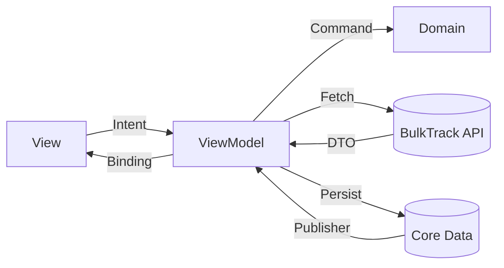

# BulkTrack iOS — Client (SwiftUI × Core Data × Combine)

> **Mission Statement** Build the **fastest, most friction-less strength-training log** that *understands* progressive overload and uses data-driven volume management to fuel muscle growth.
>
> This edition is written in **Swift 5.9 + SwiftUI** and talks to the [BulkTrack API](https://github.com/aiirononeko/bulktrack-api) over HTTP.

---

## What We Make

| Pillar                         | Why it Matters                                                                              | How it Shows Up in the App                                                                                                                |
| ------------------------------ | ------------------------------------------------------------------------------------------- | ----------------------------------------------------------------------------------------------------------------------------------------- |
| **1 Frustration-free Logging** | A set should be captured in <800 ms, even offline.                                          | Offline-first Core Data cache, single-tap set duplication, auto-prefill with last weights/reps, **display of previous session's sets for the same exercise (via UserDefaults)**, device-ID onboarding (no account needed). |
| **2 Volume-Centric Insights**  | Hypertrophy hinges on *effective volume*. Users need a gut-level view of "did I do enough?" | Daily/weekly muscle‐volume aggregation, highlight under-stimulated areas, deload warnings.                                                |
| **3 AI-Ready Data Rails**      | Tomorrow's coach learns from your history + recovery. Clean data > fancy models.            | Normalised local schema, explicit tempo/rest, deterministic IDs, background sync jobs.                                                    |
| **4 Edge-native Speed**        | Millisecond APIs worldwide without DevOps drag.                                             | Typed Swift SDK calling Cloudflare-Workers API, aggressive caching, background refresh.                                                   |

---

## Requirements

* Xcode 15.3 or later (swift-tools-version 5.9)
* iOS 17.0+ (tested on iPhone 15 / iPadOS 17)
* SwiftLint 0.54+ (optional, for linting)
* Homebrew + Make (for helper scripts)

---

## Getting Started

```bash
# 1. Clone
$ git clone https://github.com/aiirononeko/bulktrack-ios.git
$ cd bulktrack-ios

# 2. Resolve Swift packages
$ open BulkTrack.xcodeproj  # Xcode will fetch dependencies automatically

# 3. Create local config
$ cp Config/Secrets.sample.xcconfig Config/Secrets.xcconfig
# ↳ edit API_BASE_URL, APP_ID, and any feature flags
```

> **Tip:** `API_BASE_URL` defaults to `https://api.bulktrack.app`. Point it at `http://localhost:8787` when running the API with `wrangler dev`.

### Running on Simulator / Device

1. Select *BulkTrack* scheme.
2. Choose a simulator (or a physical iPhone with developer profile).
3. ⌘-R.

The first cold-start triggers `POST /v1/auth/device`; a `deviceId` UUID is generated and stored in the Keychain. Subsequent launches use a cached JWT and silent refresh.

---

## Project Layout (Clean Architecture / MVVM)

```text
BulkTrack/
├── App/                    # App & Scene delegates, DI container
├── Presentation/           # SwiftUI feature modules (Home, Log, Stats, Settings)
│   └── Components/         # Reusable UI atoms & molecules
├── Domain/                 # Pure models / business logic (no UIKit/SwiftUI)
├── Infrastructure/
│   ├── API/                # Typed OpenAPI client + request adapters
│   ├── Persistence/        # Core Data stack & repositories
│   ├── Keychain/           # Secure token storage
│   └── Services/           # Background tasks, analytics, push, etc.
└── Support/
    ├── Resources/          # Assets, SF Symbols, localisation strings
    └── Config/             # xcconfig templates & build scripts
```

### Data Flow



* **Combine publishers** keep views in sync with Core Data.
* **UserDefaults** is utilized to store and recall the user's last performed sets for each exercise, enhancing the logging experience by providing quick reference to previous workout data.
* **OpenAPI-generated Swift SDK** (via `ProtobufGenerator + openapi-swift`) ensures compile-time parity with the backend schema.

---

## API Client

The Swift SDK lives in `Infrastructure/API/Generated`. Regenerate after backend changes:

```bash
make gen-api   # Pulls api/openapi.yaml from bulktrack-api and regenerates models & clients
```

> Requires [openapi-generator-cli](https://openapi-generator.tech/) on `$PATH`.

---

## Authentication Flow

1. **Activate Device** – `POST /v1/auth/device` (+ `X-Device-Id`) → *Device Access* + *Device Refresh* tokens.
2. **Normal Usage** – Bearer *Device Access* (15 min TTL) with automatic refresh.
3. **Link Apple ID** (optional) – `POST /v1/auth/apple` exchanges tokens for *User Access*.

Tokens and the `deviceId` are stored securely using Keychain & the `SecureEnclave` when available.

---

## Local Development Scripts

| Task                    | Command                                  |
| ----------------------- | ---------------------------------------- |
| Unit tests              | `⌘-U` in Xcode *or* `make test`          |
| SwiftFormat + SwiftLint | `make format`                            |
| Generate API SDK        | `make gen-api`                           |
| Take screenshots        | `make snapshot` (uses Fastlane + XCTest) |

---

## Continuous Integration

GitHub Actions runs on every push:

1. **build** – `xcodebuild -scheme BulkTrack -destination "platform=iOS Simulator,name=iPhone 15" build`
2. **test** – `xcodebuild test` + code-coverage export
3. **lint** – SwiftLint & SwiftFormat checks
4. **api-drift** – regenerate SDK and fail if diff detected

---

## Release Workflow

1. Update `CFBundleShortVersionString` and `CFBundleVersion`.
2. `make archive` – creates an `.ipa` with dSYM & XCFrameworks.
3. Validate & upload via Transporter or `xcrun altool`.

---

## Roadmap / TODO

* Workout timer & rest-push notifications
* WatchOS companion app
* Live Activity for session timer
* Friends feed (private beta)
* LLM-powered deload & progression suggestions

---

## Acknowledgements

* [BulkTrack API](https://github.com/aiirononeko/bulktrack-api) for the backend powerhouse.
* [SwiftUI Charts](https://developer.apple.com/documentation/charts) for beautiful volume graphs.
* [Apple Design Resources](https://developer.apple.com/design/resources/) for icons & guidelines.
